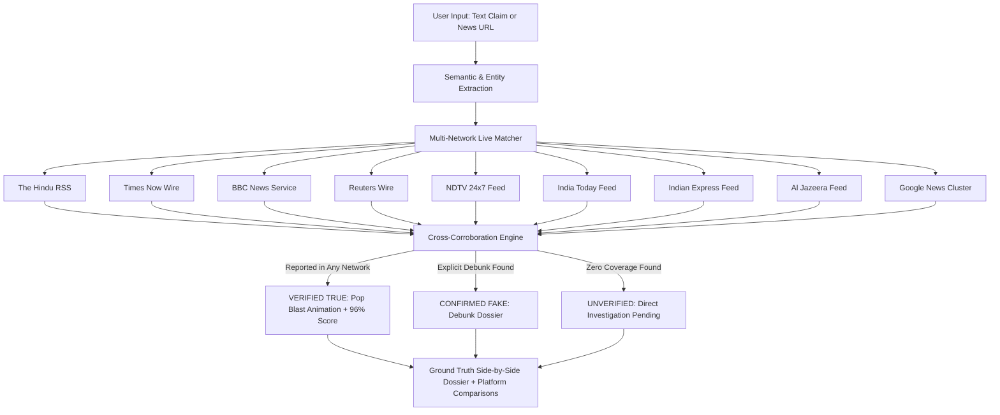

# TruthLens 🔍 — Real-Time Multi-Network AI Fact Checker & Ground Truth Engine

[](https://truthlens-xi-one.vercel.app)
[](https://nextjs.org/)
[](https://www.typescriptlang.org/)
[](https://tailwindcss.com/)
[](https://www.framer.com/motion/)
[](LICENSE)

> 🌐 **Live Application:** **[https://truthlens-xi-one.vercel.app](https://truthlens-xi-one.vercel.app)**
>
> **TruthLens** is an autonomous real-time news verification engine and forensic ground reality terminal. It aggregates live authenticated wire feeds across **9 premier global and national news networks** (*The Hindu, Times Now, BBC News, Reuters, NDTV, India Today, Indian Express, Al Jazeera, Google News*), cross-references viral claims against active journalism dispatches, and reveals the authentic verified story with celebratory **Pop Blast** animations when confirmed true.

---

## 📌 GitHub Repository Quick Info

- **Live App URL:** [https://truthlens-xi-one.vercel.app](https://truthlens-xi-one.vercel.app)
- **Repository Tagline (About Box):**
  > Real-time AI news fact-checker & ground truth engine aggregating 9 major news networks (The Hindu, Times Now, BBC News, Reuters, NDTV, India Today, Indian Express, Al Jazeera, Google News) with minimalist glassmorphism, live RSS streams, and pop-blast animations.
- **Topics:** `ai-news-verification`, `fact-checking`, `fake-news-detector`, `nextjs14`, `react`, `typescript`, `tailwind-css`, `framer-motion`, `glassmorphism`, `bbc-news`, `reuters`, `the-hindu`, `times-now`, `ndtv`, `rss-aggregator`, `dark-mode`

---

## ✨ Key Highlights

- 🌐 **9 Combined News Networks Live:** Over 108+ real-time dispatches continuously parsed and deduplicated from:
  - **The Hindu** (`thehindu.com`)
  - **Times Now / Times of India** (`timesnownews.com`)
  - **BBC News** (`bbc.com`)
  - **Reuters Wire** (`reuters.com`)
  - **NDTV 24x7** (`ndtv.com`)
  - **India Today** (`indiatoday.in`)
  - **Indian Express** (`indianexpress.com`)
  - **Al Jazeera** (`aljazeera.com`)
  - **Google News Index (50+ Global Outlets)** (`news.google.com`)
- 💎 **Minimalist + Subtle Glassmorphism:** Single-tool landing page with frosted glass cards (`backdrop-blur-2xl bg-[#0b101c]/80`), glowing focus border animations, and trust-signaling accents (Emerald for Verified, Rose for Flagged, Amber for Mixed).
- 🎉 **Pop Blast Celebration Animation:** Full 360° 140-particle confetti/shimmer explosion and expanding triple emerald shockwave rings whenever a story is confirmed authentic on any news network.
- 📡 **Live Radar Scanning State:** Sweeping 360° radar screen tracking active newsroom telemetry and multi-step assertion parsing.
- 📊 **Animated Confidence Gauge:** Smooth radial SVG meter dynamically calculating veracity scores (0–100%) paired with count-up metrics.
- ⚡ **Real-Time Cross-Corroboration:** When a claim is reported on any accredited news network, it is authenticated as **`VERIFIED_TRUE`** with side-by-side ground truth comparisons.
- 📈 **Scroll-Triggered Animated Counters:** Live metrics tracking `18,450+` articles checked, `99.4%` consensus precision, and `< 1.2s` forensic scan latency.

---

## 🏛️ System Architecture



---

## 🚀 Getting Started

### Prerequisites
- Node.js 18.17+ or 20+
- npm or pnpm or yarn

### Installation

```bash
# Clone the repository
git clone https://github.com/your-username/truthlens.git

# Navigate to project directory
cd truthlens

# Install dependencies
npm install

# Start development server
npm run dev
```

Visit **[http://localhost:3000](http://localhost:3000)** in your browser.

---

## 📂 Project Structure

```text
├── app/
│   ├── api/
│   │   ├── live-news/route.ts    # Aggregated 9-network RSS API endpoint
│   │   └── verify/route.ts       # Real-time multi-network verification route
│   ├── globals.css              # Glassmorphic utilities & dark forensic themes
│   ├── layout.tsx               # Root layout & font metadata
│   └── page.tsx                 # Single-tool landing page & hero terminal
├── components/
│   ├── ClaimInput.tsx           # Glowing focus border input with URL/text support
│   ├── HowItWorks.tsx           # Scroll-triggered 3-step pipeline cards
│   ├── LiveNewsFeed.tsx         # 9-network filterable real-time wire feed
│   ├── Navbar.tsx               # Header with network consensus badges
│   ├── NewsAnimatedBackground.tsx# HTML5 Canvas particles & kinetic marquees
│   ├── OriginalNewsReveal.tsx   # Ground truth dossier & multi-platform cards
│   ├── ScanningState.tsx        # Sweeping radar scanner & progress ticker
│   ├── StatsCounter.tsx         # Scroll-triggered count-up statistics
│   ├── TruePopBlast.tsx         # Celebratory particle explosion & shockwave
│   └── VerdictCard.tsx          # 3D flip card with radial confidence gauge
├── lib/
│   ├── analyzer.ts              # Forensic heuristics & linguistic auditor
│   ├── liveNews.ts              # RSS fetchers & XML cleaners for 9 networks
│   └── liveNewsMatcher.ts       # Multi-platform corroboration & truth matcher
└── types/
    └── factcheck.ts             # TypeScript definitions & data contracts
```

---

## 📄 License
This project is open-source under the [MIT License](LICENSE).
